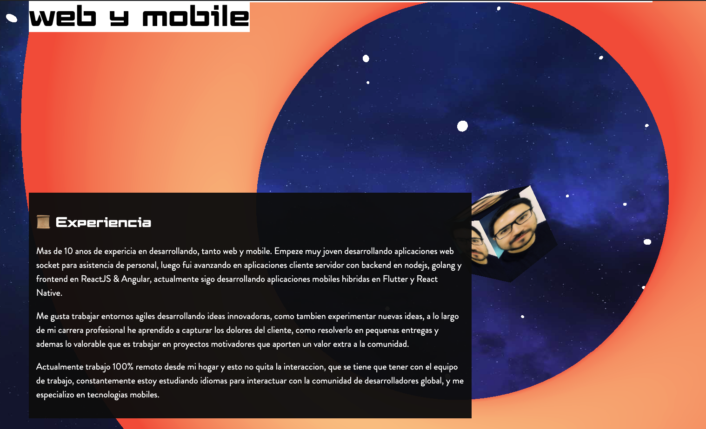
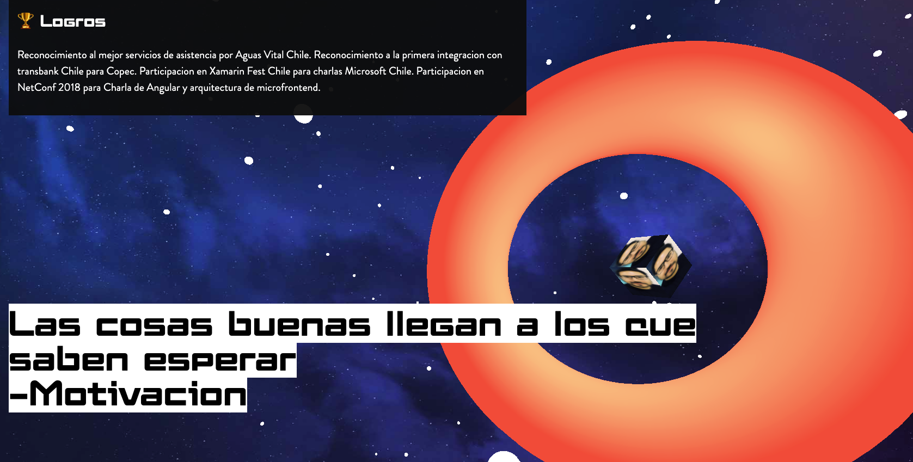

<p align="center">
    <h1>Portafolio 3D🤩 : Animate Threejs</h1>
</p>


## English
### Author inspirate  @Fireship https://www.youtube.com/watch?v=Q7AOvWpIVHU

### Build a Mindblowing 3D Portfolio Website😇:

* ▶️ Mindblowing 3D Websites
* ▶️ What we’re building
* ▶️ Project Setup
* ▶️ Scene
* ▶️ Camera
* ▶️ Renderer
* ▶️ Geometry
* ▶️ Material
* ▶️ Mesh
* ▶️ Animation Loop


-----------------------------------------
## Español
### Sitio web portafio 3D😇:

* ▶ ️ Sitios web 3D
* ▶ ️ Three.js
* ▶ ️ Configuracion del proyecto
* ▶ ️ Escenas
* ▶ ️ Cámara
* ▶ ️ Renderizador
* ▶ ️ Geometría
* ▶ ️ Material
* ▶ ️ Bucle de animación
* ▶ ️ Controles de órbita 
* ▶ ️ Bucle de animación
* ▶ ️ Generación aleatoria
* ▶ ️ Fondo de la escena
* ▶ ️ Fondo de la escena
* ▶  Mapeado de texturas
* ▶  Animación de desplazamiento


### Demo 1


### Demo 2



### Demo 2




# Video demostración:
[Youtube](https://www.youtube.com/watch?v=Bgb82cCue1g)


## Mi canal de youtube 

[Youtube](https://www.youtube.com/channel/UCQsrs_h91Q-baLx-n_rcdNg)

## Mis articulos en medium
[medium](https://devjaime.medium.com/)


## Mi twitter por si quieres contacterme
[medium](https://twitter.com/HsJhernandez)

### :heart: ¿Te gusto este proyecto?

Si te gusto este proyecto comparte y dale una estrella :star: en Github y no dudes en contactarme.


# Scrollable 3D Animation with Three.js

- Watch the [full tutorial](https://youtu.be/Q7AOvWpIVHU) on YouTube
- [Scrollable Three.js Animation](https://fireship.io/snippets/threejs-scrollbar-animation) Snippet

## Usage

```
git clone <this-repo>
yarn install
yarn dev
```